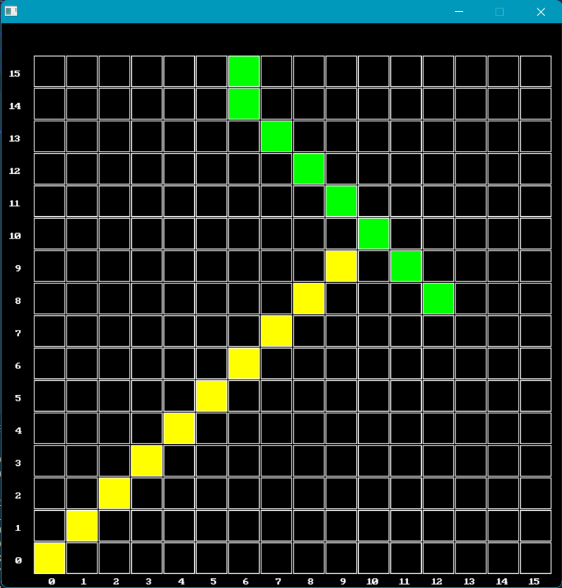
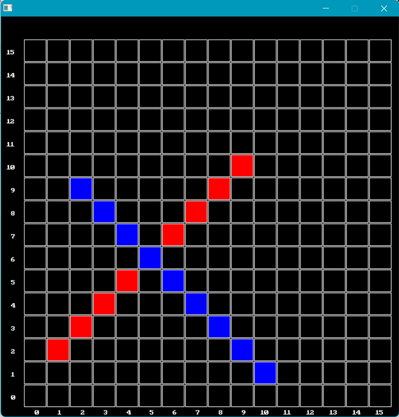
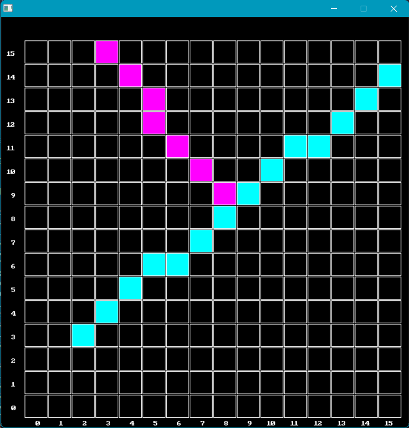
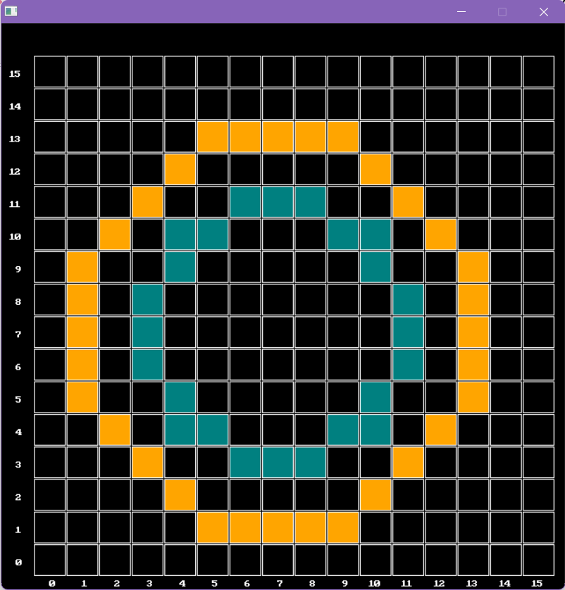
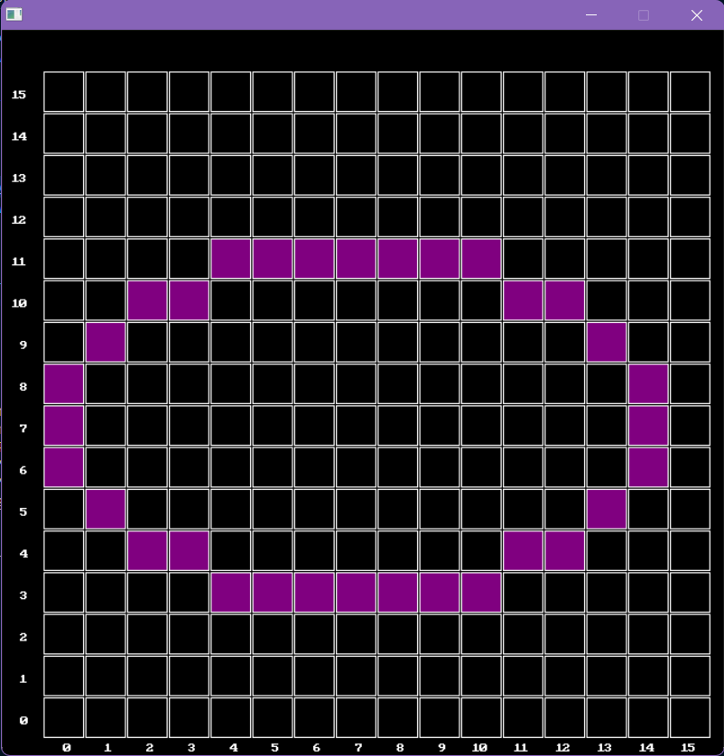

# GraphicsH_CPP_Collection

## Language Used:

     

This repo contains C++ codes that use **graphics.h** library for performing basic graphics operations in Computer Graphics. The codes implement very basic CG Algorithms in **graphics.h** library in an interesting way. 

The **graphics.h** library in C++ is a non-standard addition that was originally incorporated with the Turbo C / Turbo C++ compilers developed by Borland. This library is primarily utilized to incorporate graphical operations within a program. It offers a variety of functions that enable the creation of diverse shapes, the display of text in various fonts, color modifications, and more. The **graphics.h** library can be employed to construct graphics programs, animations, projects, and games. However, it is crucial to note that **graphics.h** is deemed outdated and is not typically used in contemporary programming. It is predominantly associated with DOS systems and older Windows systems that operated on DOS or included a DOS subsystem. For modern graphics programming, other libraries such as SDL, GTK+, Qt, and OGRE are frequently recommended. 

## Installation

To install **graphics.h**, please visit the [installation instructions](https://github.com/genpfault/sdl-bgi/blob/main/INSTALL.md).
Navigate to **INSTALL.md** for detailed instructions on the installation. 

## Important Note

This repository contains a file *graphic.cpp*, which should **NOT** be confused with the original **graphics.h**. The *graphic.cpp* is a custom file based on the **SDL2** Library (zlib license) and utilizes some code from the **SDL_bgi** Library (zlib license). Its sole purpose is to view a 2D plane as a grid of pixels denoted by boxes, where each box represents a single pixel unit.

You can simply replace `#include "graphic.cpp"` with `#include <graphics.h>` to use the original library without much change in the original code. Feel free to create your own functions in *graphic.cpp* to extend its usability.

## Examples:

Down Below are some outputs produced by above Programs using the *graphic.cpp* file:

    
    
    
    
    

